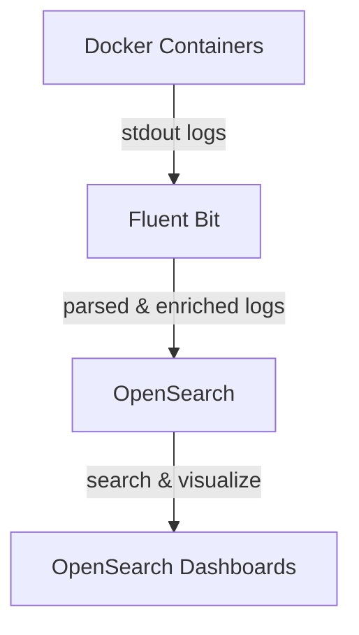

# Fluent Bit Integration Guide

## Overview

Fluent Bit is a lightweight and fast log processor and forwarder. In this project, it is used to collect logs from all Docker containers (including the app, Temporal, and Mattermost), enrich them with metadata, and forward them to OpenSearch for search and analysis.

## Architecture



- **Docker Containers**: All services (app, temporal, mattermost, etc.) log to stdout/stderr.
- **Fluent Bit**: Tails Docker log files, parses them, adds metadata (like container name), and forwards to OpenSearch.
- **OpenSearch**: Stores and indexes logs.
- **OpenSearch Dashboards**: Lets you search and visualize logs.

## How Fluent Bit is Configured

- **Service**: Defined as `fluent-bit` in `docker-compose.yml`.
- **Config File**: `fluent-bit.conf` in the project root, mounted into the container.
- **Log Input**: Tails `/var/lib/docker/containers/*/*.log` (all container logs on the host).
- **Parsing**: Uses a Docker JSON log parser.
- **Filters**:
  - Adds Kubernetes-style metadata (including container name).
  - Adds an `environment` field (set to `production`).
- **Output**: Forwards all logs to OpenSearch (`opensearch:9200`), index `docker-logs`.

### Key Sections of `fluent-bit.conf`

```ini
[SERVICE]
    Flush        1
    Daemon       Off
    Log_Level    info

[INPUT]
    Name              tail
    Path              /var/lib/docker/containers/*/*.log
    Parser            docker
    Tag               kube.*
    Refresh_Interval  5
    Skip_Long_Lines   On
    Docker_Mode       On

[PARSER]
    Name        docker
    Format      json
    Time_Key    time
    Time_Format %Y-%m-%dT%H:%M:%S.%L
    Time_Keep   On

[FILTER]
    Name                kubernetes
    Match               *
    Merge_Log           On
    Keep_Log            Off
    K8S-Logging.Parser  On
    K8S-Logging.Exclude On

[FILTER]
    Name                modify
    Match               *
    Add                 environment production

[OUTPUT]
    Name  es
    Match *
    Host  ${FLUENT_ELASTICSEARCH_HOST}
    Port  ${FLUENT_ELASTICSEARCH_PORT}
    Index docker-logs
    Type  _doc
    Logstash_Format On
    Replace_Dots    On
    Retry_Limit     False
```

## How to Use

1. **Start the stack**:
   ```bash
   docker-compose up -d
   ```
2. **Fluent Bit** will automatically collect logs from all running containers.
3. **View logs** in OpenSearch Dashboards at http://localhost:5601 (search index: `docker-logs-*`).
4. **Filter logs** by `container_name` to see logs from specific services (e.g., `maestro-temporal`, `maestro-mattermost`).

## Troubleshooting

- **No logs in OpenSearch?**
  - Check Fluent Bit logs: `docker-compose logs -f fluent-bit`
  - Ensure containers are running and generating logs.
  - Ensure OpenSearch is healthy (`docker-compose logs -f opensearch`).
- **Log fields missing?**
  - Check the `fluent-bit.conf` filters and parser sections.
- **Performance**:
  - Fluent Bit is lightweight, but for very high log volumes, consider tuning `Flush` and buffer settings.

## References
- [Fluent Bit Documentation](https://docs.fluentbit.io/manual/)
- [OpenSearch Documentation](https://opensearch.org/docs/) 