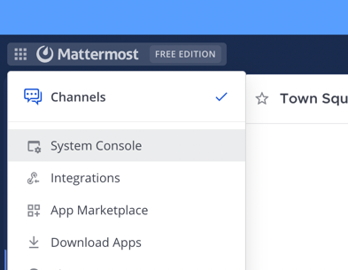
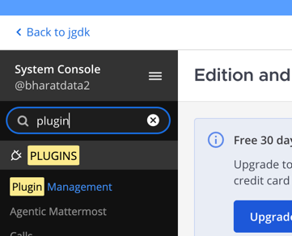
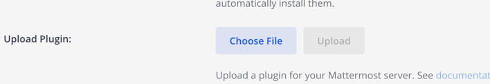
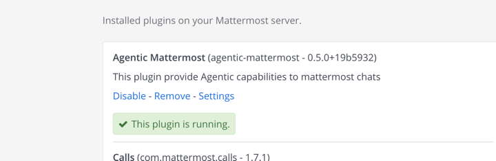
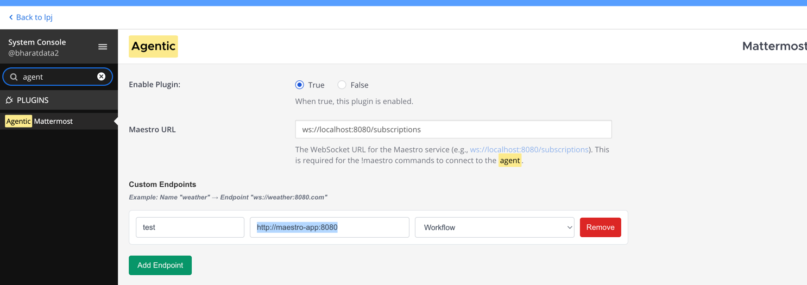
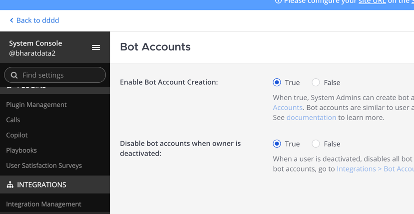
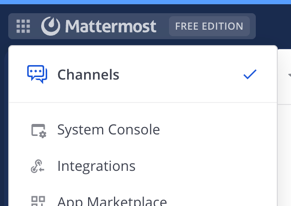
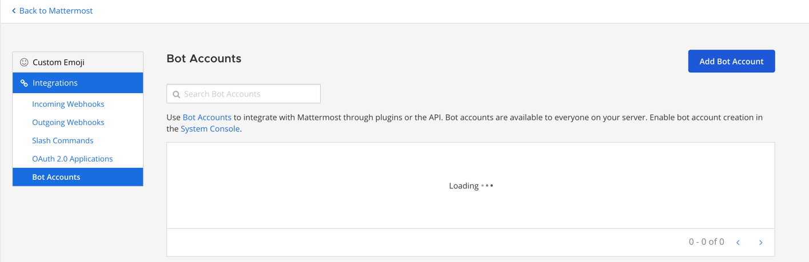
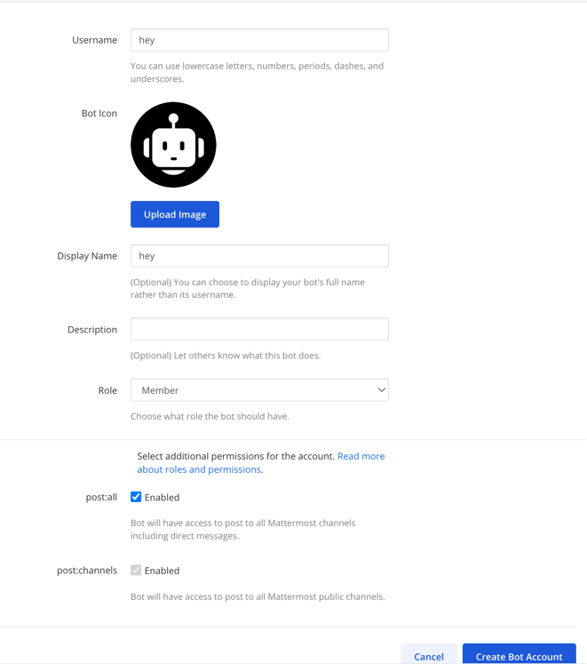
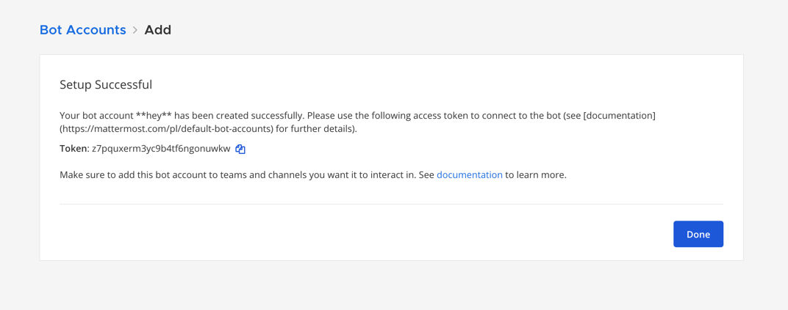

# Maestro App Setup Guide

## Prerequisites
- Docker installed and running
- Maven wrapper (`mvnw`) available
- OpenAI API key

## Setup Instructions

### 1. Build the Application
```bash
./mvnw clean install
docker build -t maestro-app .
```

### 2. Configure Environment Variables
```bash
export OPENAI_API_KEY=your_openai_api_key_here
```

### 3. Start Mattermost
```bash
./docker-run.sh start prod
```

### 4. Configure Mattermost Plugin

#### Access Mattermost UI
Open your browser and navigate to: http://localhost:8065

#### Upload Plugin
1. Upload the plugin file: `agentic-mattermost-plugin-0.5.0+19b5932.tar.gz`

#### System Console Configuration
1. Go to **System Console**

   

2. Navigate to **Plugin Management**

   

3. Upload the plugin file
   


4. **Enable the Plugin**



5. **Configure the plugin**




#### Bot Account Setup
1. **Enable Bot Accounts**
   


2. **Create Bot Account**
    - Go to **Integrations**

   

    - Click **Add Bot**
      
   

    - Configure bot settings
    
   

    - **Copy the bot token** (you'll need this for the next step)
      
   

### 5. Configure Maestro App Environment
```bash
export MATTERMOST_HOST=http://maestro-mattermost:8065/api/v4
export MATTERMOST_TOKEN={Value from bot token step above}
```

### 6. Start Maestro App
```bash
docker-compose -p maestro -f docker-compose.app.yml up -d
```


## Stopping the Application

To stop all services:
```bash
./docker-run.sh clean
```

## Summary of URLs
- **Mattermost UI**: http://localhost:8065
- **Maestro App**: http://maestro-app:8080

## Required Files
- `agentic-mattermost-plugin-0.5.0+19b5932.tar.gz` - Mattermost plugin
- `docker-compose.app.yml` - Docker compose configuration
- `docker-run.sh` - Docker management script